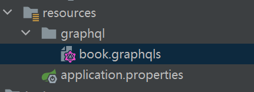

## 什么是 Graphql
GraphQL 是一种针对 Graph（图状数据）进行查询特别有优势的 Query Language（查询语言），所以叫做 GraphQL。它跟 SQL 的关系是共用 QL 后缀，就好像「汉语」和「英语」共用后缀一样，但他们本质上是不同的语言。GraphQL 跟用作存储的 NoSQL 没有必然联系，虽然 GraphQL 背后的实际存储可以选择 NoSQL 类型的数据库，但也可以用 SQL 类型的数据库，或者任意其它存储方式（例如文本文件、存内存里等等）。

作者：Cat Chen
链接：https://www.zhihu.com/question/264629587/answer/949588861
来源：知乎
著作权归作者所有。商业转载请联系作者获得授权，非商业转载请注明出处。

强烈建议阅读完上面文章后再继续阅读本文章!!!!!!!!!

## SpringBoot 对 Graphql 的支持力度
目前: `Requires Spring Boot >= 2.7.0.M1 and < 3.0.0-M1.` , 其他请寻找第三方适配方案 或者 自行查找测试库

[https://www.youtube.com/watch?v=eVqmB2hsIVk](https://www.youtube.com/watch?v=eVqmB2hsIVk)

## 开始
`SpringBoot 2.7.0-M2`
`org.projectlombok:lombok`
`spring-boot-starter-graphql`
`spring-boot-starter-data-mongodb-reactive`
`spring-boot-starter-webflux`

这里细心的同学可能就注意到了: `spring-boot-starter-graphql`  前缀是 `spring-boot-starter` 所以是由 Spring 官方支持的

```groovy
plugins {
    id 'org.springframework.boot' version '2.7.0-M2'
    id 'io.spring.dependency-management' version '1.0.11.RELEASE'
    id 'java'
}

group = 'com.github.zhengchalei'
version = '0.0.1'
sourceCompatibility = '11'

repositories {
    mavenCentral()
    maven { url 'https://repo.spring.io/milestone' }
    maven { url 'https://repo.spring.io/snapshot' }
}

dependencies {
//    runtimeOnly 'com.h2database:h2'
//    runtimeOnly 'io.r2dbc:r2dbc-h2'
    implementation 'org.springframework.boot:spring-boot-starter-graphql'
    testImplementation 'org.springframework.graphql:spring-graphql-test'

    implementation 'org.springframework.boot:spring-boot-starter-data-mongodb-reactive'

    compileOnly 'org.projectlombok:lombok'
    annotationProcessor 'org.projectlombok:lombok'

    implementation 'org.springframework.boot:spring-boot-starter-webflux'
    developmentOnly 'org.springframework.boot:spring-boot-devtools'
    testImplementation 'org.springframework.boot:spring-boot-starter-test'
    testImplementation 'io.projectreactor:reactor-test'
}

tasks.named('test') {
    useJUnitPlatform()
}
```


## application.properties
```properties
spring.graphql.path=/graphql
spring.graphql.websocket.path=/graphql

spring.data.mongodb.host=localhost
spring.data.mongodb.port=27017
spring.data.mongodb.database=test
spring.data.mongodb.username=mongo
spring.data.mongodb.password=mongo
spring.data.mongodb.authentication-database=admin

logging.level.org.springframework.data.mongodb=debug
```

## 实体
```java
/**
 * 作者
 *
 * @author 郑查磊
 * @date 2022/03/14
 */
@Data
@Document("author")
public class Author {

    @Id
    private String id;

    @Indexed(unique = true)
    private String name;

}

/**
 * 书
 *
 * @author 郑查磊
 * @date 2022/03/14
 */
@Data
@NoArgsConstructor
@AllArgsConstructor
@Document("book")
public class Book {

    @Id
    private String id;

    private String name;

    @Indexed
    private String authorId;

}
```

## Repository
```java
/**
 * 作者库
 *
 * @author 郑查磊
 * @date 2022/03/14
 */
public interface AuthorRepository extends ReactiveMongoRepository<Author, String> {
}

/**
 * 书籍库
 *
 * @author 郑查磊
 * @date 2022/03/14
 */
public interface BookRepository extends ReactiveMongoRepository<Book, String> {

    /**
     * 查找图书作者id
     *
     * @param authorId 作者id
     * @return {@link Flux}<{@link Book}>
     */
    Flux<Book> findBooksByAuthorId(String authorId);

}
```

## graphql
先在 `resources` 新建 `resources` 目录, 新建文件 `book.graphqls`


```graphql
# 定义查询
type Query {
    findBooks: [Book]
    findAuthorsById(id: ID): Author
}

# 定义作者实体
type Author {
    id: ID
    name: String
    # 关联多个书籍
    books: [Book]
}

# 定义书籍
type Book {
    id: ID
    name: String
    authorId: ID
    # 这里只为了演示, 可嵌套
    author: Author
}
```
## Api
`BookResource` 与 `book.graphqls` 对应关系, 自行理解, 表示不难. 这套表示方式,
是由 `Spring` 定义的, 个人觉得表现形式不是很好
由于 `Java` 是强类型, 导致对这种动态松散型表达力欠缺, 像 JS 或 Kotlin 会好很多
```java
import com.github.zhengchalei.domain.Author;
import com.github.zhengchalei.domain.Book;
import com.github.zhengchalei.repository.AuthorRepository;
import com.github.zhengchalei.repository.BookRepository;
import lombok.RequiredArgsConstructor;
import lombok.extern.slf4j.Slf4j;
import org.springframework.graphql.data.method.annotation.Argument;
import org.springframework.graphql.data.method.annotation.SchemaMapping;
import org.springframework.stereotype.Controller;
import reactor.core.publisher.Flux;
import reactor.core.publisher.Mono;

/**
 * 书资源
 *
 * @author 郑查磊
 * @date 2022/03/14
 */
@Slf4j
@Controller
@RequiredArgsConstructor
public class BookResource {

    private final AuthorRepository authorRepository;
    private final BookRepository bookRepository;

    @SchemaMapping(typeName = "Query", field = "findBooks")
    public Flux<Book> findBooks() {
        return this.bookRepository.findAll();
    }

    @SchemaMapping(typeName = "Query", field = "findAuthorsById")
    public Mono<Author> findAuthorsById(@Argument String id) {
        return this.authorRepository.findById(id);
    }

    @SchemaMapping(typeName = "Author")
    public Flux<Book> books(Author author)  {
        return this.bookRepository.findBooksByAuthorId(author.getId());
    }

    @SchemaMapping(typeName = "Book")
    public Mono<Author> author(Book book)  {
        return this.authorRepository.findById(book.getAuthorId());
    }
}
```

## 初始化查询数据
```java

import com.github.zhengchalei.domain.Author;
import com.github.zhengchalei.domain.Book;
import com.github.zhengchalei.repository.AuthorRepository;
import com.github.zhengchalei.repository.BookRepository;
import lombok.extern.slf4j.Slf4j;
import org.springframework.stereotype.Service;
import reactor.core.publisher.Flux;

/**
 * 初始化数据
 *
 * @author 郑查磊
 * @date 2022/03/15
 */
@Slf4j
@Service
public class InitData {

    private final AuthorRepository authorRepository;
    private final BookRepository bookRepository;

    public InitData(AuthorRepository authorRepository, BookRepository bookRepository) {
        this.authorRepository = authorRepository;
        this.bookRepository = bookRepository;
        init();
    }

    public void init() {
        create("曹雪芹", "红楼梦", "题敦诚琵琶行传奇");
        create("吴承恩", "西游记");
    }

    private void create(String authorName, String... books) {
        Author author = new Author();
        author.setName(authorName);
        this.authorRepository.save(author)
                .thenMany(
                        Flux
                                .just(books)
                                .map(name -> {
                                    Book book = new Book();
                                    book.setName(name);
                                    book.setAuthorId(author.getId());
                                    return book;
                                })
                                .flatMap(bookRepository::save)
                )
                .subscribe();
    }
}
```

## 测试
打开页面 [http://localhost:8080/graphiql?path=/graphql&wsPath=/graphql](http://localhost:8080/graphiql?path=/graphql&wsPath=/graphql)
可自行 删除或者新增条件 字段测试
查询过程中 打开 Application Log 注意观察日志
看程序如何执行的
```graphql
{
  findAuthorsById(id: "623076210179ae7cc2cc960b") {
    id
    name
    books {
      id
      name
    }
  }
  findBooks {
    id
    name
    author {
      id
      name
      books {
        id
        name
      }
    }
  },
}
```
不出意外能得出以下结果, 注意 id 不同 查询条件变动
```json
{
  "data": {
    "findAuthorsById": {
      "id": "623076210179ae7cc2cc960b",
      "name": "曹雪芹",
      "books": []
    },
    "findBooks": [
      {
        "id": "62307a341fc7cc64093fd942",
        "name": "红楼梦",
        "author": {
          "id": "62307a341fc7cc64093fd93f",
          "name": "曹雪芹",
          "books": [
            {
              "id": "62307a341fc7cc64093fd942",
              "name": "红楼梦"
            },
            {
              "id": "62307a341fc7cc64093fd943",
              "name": "题敦诚琵琶行传奇"
            }
          ]
        }
      },
      {
        "id": "62307a341fc7cc64093fd941",
        "name": "西游记",
        "author": {
          "id": "62307a341fc7cc64093fd940",
          "name": "吴承恩",
          "books": [
            {
              "id": "62307a341fc7cc64093fd941",
              "name": "西游记"
            }
          ]
        }
      },
      {
        "id": "62307a341fc7cc64093fd943",
        "name": "题敦诚琵琶行传奇",
        "author": {
          "id": "62307a341fc7cc64093fd93f",
          "name": "曹雪芹",
          "books": [
            {
              "id": "62307a341fc7cc64093fd942",
              "name": "红楼梦"
            },
            {
              "id": "62307a341fc7cc64093fd943",
              "name": "题敦诚琵琶行传奇"
            }
          ]
        }
      }
    ]
  }
}
```
## 参考文章
1. [reactive-apis-with-spring-webflux](https://developer.okta.com/blog/2018/09/24/reactive-apis-with-spring-webflux)
2. [spring-webflux-websockets-react](https://developer.okta.com/blog/2018/09/25/spring-webflux-websockets-react)
3. [Spring Tips: @Controllers: GraphQL](https://www.youtube.com/watch?v=eVqmB2hsIVk)